# IMDB_Movies_Analysis
                                                    

## Description:
The dataset provided is related to IMDB.
A potential problem to investigate could be: "What factors influence the success of a movie on IMDB?" Here, success can be defined by high IMDB ratings.
The impact of this problem is significant for movie producers, directors, and investors who want to understand what makes a movie successful to make informed decisions in their future projects.

--------------------------------------------------------------------------------------------------------------------------------------------------------------------------------------------------------------------
Data Cleaning: This step involves preprocessing the data to make it suitable for analysis. It includes handling missing values, removing duplicates, converting data types if necessary, and possibly feature engineering.
The dataset has more than 5000 rows and 28 columns.
Dataset has following columns:
Director Name, Director Facebook Likes, Actor 1 Name, Actor 1 Facebook Likes, Actor 2 Name, Actor 2 Name Facebook Likes, Actor 3 Name, Actor 3 Facebook Likes, colour, number of critic for review, duration,
gross, genres, movie title, number of voted users, cast total facebook likes, facenumber in poster, plot keywords, movie IMDB link, language, country, content rating, budget, title year, IMDB score,
aspect ratio, etc.

Columns which are required for analysis are retained and other columns are removed.
Retained columnes are as follows:
Director Name, Movie Title, Language, Genres, Duration, Gross, Budget, IMDB Score.

Director Name, Movie Title, Language, Genres are the categorical columns. Rows having blank values in these columns are deleted.
Duration, Gross, Budget, IMDB Score are numerical columns. Descriptive Statistical analysis is performed, also, histogram is plotted to check the spread of data.As the data is concentrated near median, blanks are
replaced by median values. After data cleaning, data is left with about 4800 rows and 8 Columns.

--------------------------------------------------------------------------------------------------------------------------------------------------------------------------------------------------------------------
Data Analysis: Here, we will explore the data to understand the relationships between different variables. We might look at the correlation between movie ratings and other factors like genre, director, budget, etc.

--------------------------------------------------------------------------------------------------------------------------------------------------------------------------------------------------------------------
A. Movie Genre Analysis: Analyze the distribution of movie genres and their impact on the IMDB score.
Task: Determine the most common genres of movies in the dataset. Then, for each genre, calculate descriptive statistics (mean, median, mode, range, variance, standard deviation) of the IMDB scores.

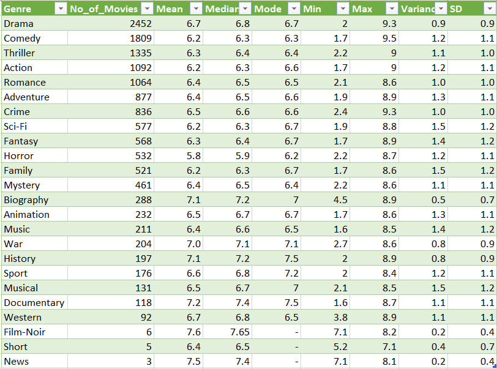

Here, Number of movies respective to the genres are calculated using power query. And mean, median, mode, range, variance, standard deviation are calculated using standard formulae.

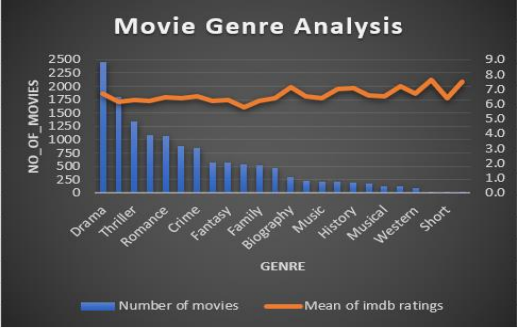
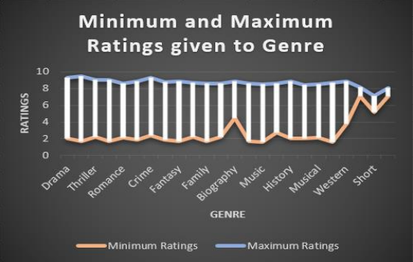

Insights: 
• Drama is the most popular genre having applied to 2452 movies and has average rating of 6.7. 
• News is the least popular genre having applied to only 3 movies and has average rating 7.5. 
• Highest rating is given to the movie having comedy genre which is 9.5. 
• Lowest rating is given to the movie having music and documentary genres which is 1.6.

--------------------------------------------------------------------------------------------------------------------------------------------------------------------------------------------------------------------
B. Movie Duration Analysis: Analyze the distribution of movie durations and its impact on the IMDB score.
Task: Analyze the distribution of movie durations and identify the relationship between movie duration and IMDB score.

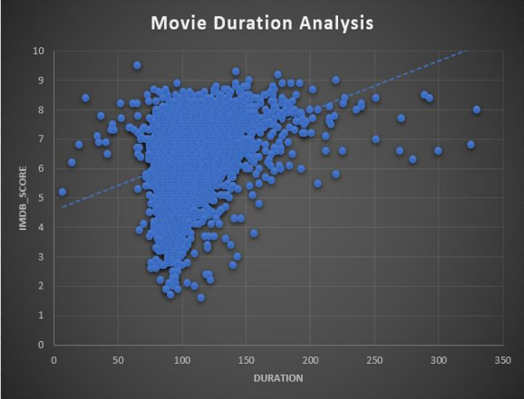

Here, scatter plot is plotted between movie duration and IMDB score.

Insights: 
• Average rating slightly increases as the duration increases. 
• When duration is 65 minutes rating is 9.5 which is maximum. 
• When duration is 115 minutes rating is 1.6 which is minimum. 
• Lowest and also highest ratings are given to the movies having duration between 50 to 200.

--------------------------------------------------------------------------------------------------------------------------------------------------------------------------------------------------------------------
C. Language Analysis: Examine the distribution of movies based on their language.
Task: Determine the most common languages used in movies and analyze their impact on the IMDB score using descriptive statistics.

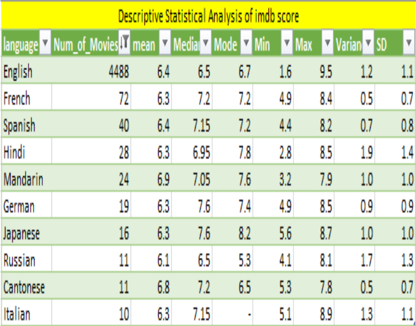
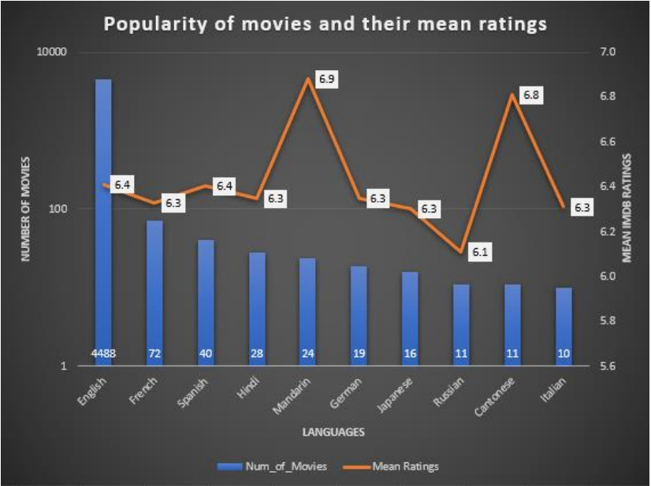

Bar chart is plotted to see the most popular movie language.

Insights: 
• English is the most popular language used in 4488 movies having average ratings of 6.4. 
• Lowest rating is also given to English movie which is 1.6 and highest rating is also given to English movie which is 9.5

--------------------------------------------------------------------------------------------------------------------------------------------------------------------------------------------------------------------
D. Director Analysis: Influence of directors on movie ratings.
Task: Identify the top directors based on their average IMDB score and analyze their contribution to the success of movies using percentile calculations.

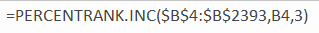

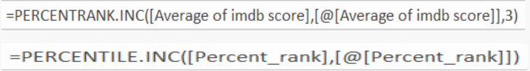

Percentile rank and percentile is calculated to know the influence of directors on movie ratings.

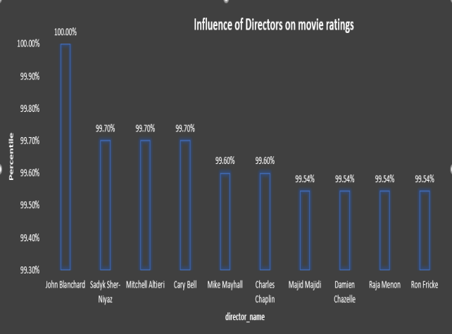

Insights: 
• Top director is John Blanchard with average imdb ratings of 9.5

--------------------------------------------------------------------------------------------------------------------------------------------------------------------------------------------------------------------
E. Budget Analysis: Explore the relationship between movie budgets and their financial success.
Task: Analyze the correlation between movie budgets and gross earnings, and identify the movies with the highest profit margin.

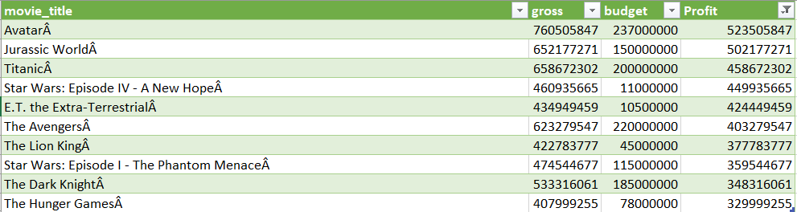

Correlation between gross and budget is calculated using correl() function.

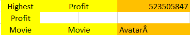

max() function is used to caculate the highest profit and xlookup() is used to calculate the name of highest profit movie.

Insights: 
• Correlation is near to 0 than to 1, hence weak linear correlation between budget and gross. 
• Avatar has the highest profit of 523505847.

--------------------------------------------------------------------------------------------------------------------------------------------------------------------------------------------------------------------
